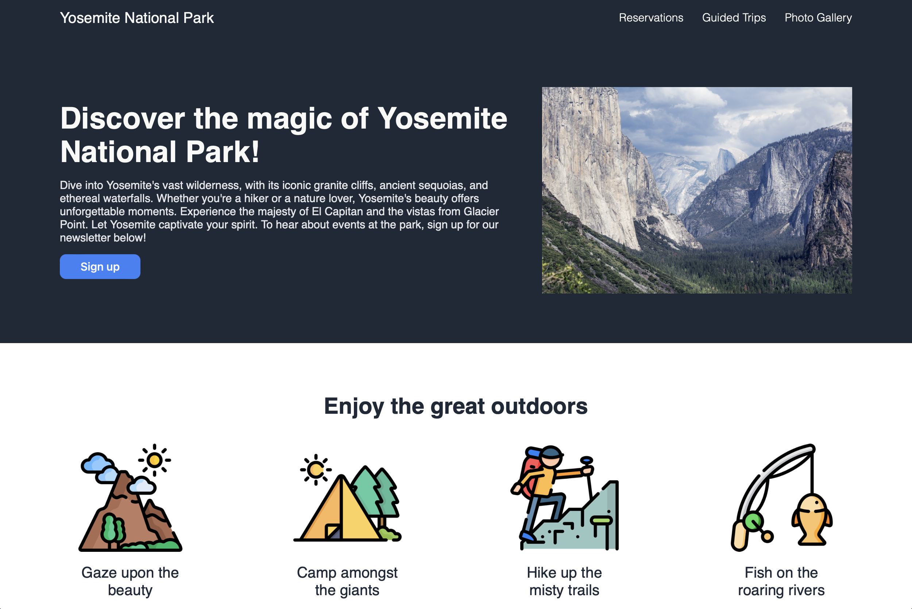

# Landing Page

A modern and responsive (beginner-level) landing page for showcasing services.

## Description

This project is a simple, responsive landing page built with HTML and CSS. It features a navigation bar, a hero section with a background image, and a services section with images and descriptions. It is a home page only, so do not expect the interactive elements to function.

## Screenshot



## Table of Contents

- [Description](#description)
- [Screenshot](#screenshot)
- [Features](#features)
- [Installation](#installation)
- [Usage](#usage)
- [Tech Stack](#tech-stack)
- [License](#license)
- [Contact Information](#contact-information)

## Features

- (Beginner-level) Responsive design
- Navigation bar
- Hero section with background image
- Services section with images and descriptions

## Installation

1. Clone the repository:
   ```sh
   git clone https://github.com/sourdoughbredd/landing-page.git
   ```
2. Navigate to the project directory:
   ```sh
   cd landing-page
   ```
3. Open `index.html` in your preferred web browser.

## Usage

- Open `index.html` in a web browser to view the landing page.

## Tech Stack

- HTML
- CSS

## License

This project is licensed under the MIT License.

## Contact Information

For any questions or suggestions, please contact Brett Bussell at [bwbussell24@gmail.com](mailto:bwbussell24@gmail.com).
